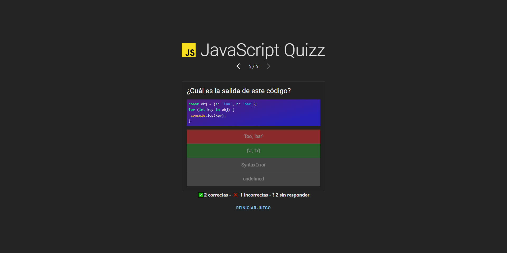

# JavaScript Quiz App con Zustand



Este es un proyecto de **quiz de JavaScript** que utiliza **Zustand** para la gestión del estado. El objetivo es permitir a los usuarios responder preguntas de JavaScript y obtener su puntuación al final.

## Características

- Preguntas dinámicas sobre JavaScript.
- Puntuación en tiempo real.
- Navegación entre preguntas.
- Sistema de gestión de estado ligero utilizando **Zustand**.

## Tecnologías utilizadas

- **React** para la interfaz de usuario.
- **Zustand** para la gestión del estado.
- **JavaScript** para la lógica del quiz.
- **CSS** para los estilos.
- **Vite** para el bundling y desarrollo.
- **TypeScript** para el tipado.

## Instalación

Sigue estos pasos para instalar y ejecutar el proyecto en tu entorno local:

1. Clona el repositorio:
   ```sh
   git clone https://github.com/tu-usuario/tu-repositorio.git
   ```

2. Navega al directorio del proyecto:
   ```sh
   cd javascript-quizz
   ```

3. Instala las dependencias:
   ```sh
   npm install
   ```

4. Inicia el servidor de desarrollo:
   ```sh
   npm start
   ```

5. Abre el navegador en `http://localhost:5173/` para ver el proyecto en acción.


